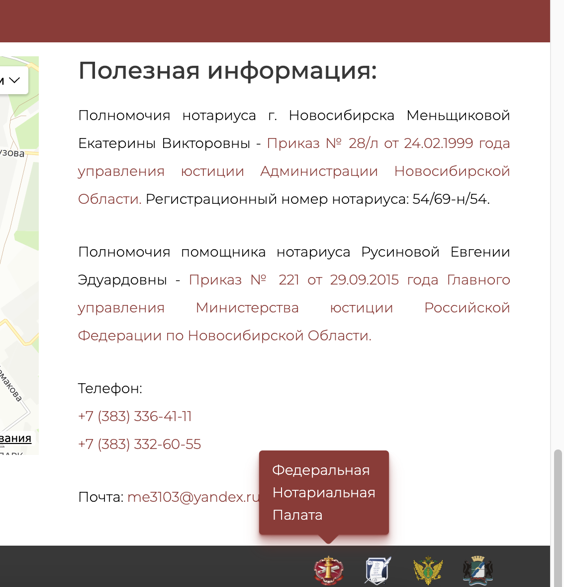

  
# [Сайт Нотариуса / Notary Website](https://www.notarymen.ru "Сайт Нотариуса г.Новосибирска")

# |RU|

Данный вебсайт был разработан по заказу нотариуса из Новосибирска. На сайте применяются, помимо `HTML, JS, CSS`, такие технологии как:

-   jQuery
-   PHP(серверная часть + PHP Mailer для обработки почтовых сообщений через форму)
-   Yandex api (для карты)
-   Google fonts api
-   Moment Timezone

________________
Папка **example mailer** содержит логику обработки формы на сайте как на стороне клиента (`Native JS`) так и на стороне сервера (`PHP`). Также там содержатся стили данной формы. **PHP Mailer** используется для отправки писем с серверной почты на почту нотариусу.

Папка **current_js** содержит кастомные js файлы для различной логики на сайте. Один из скриптов (используется библиотека Moment Timezone) отвечает за временные точки благодаря которым получается регулировать возможные объявления, которые могут даваться нотариусом на сайте, а также, для регулировки года в футере сайта. Два других отвечают за анимации на сайте и показ подсказок-текста или подсказок-изображений.

Скриншоты прилагаются в самом конце README.

# |EN|

This website was designed by order of a notary from Novosibirsk. This site uses, in addition to `HTML, JS, CSS`, such technologies as:

-   jQuery
-   PHP (server side + PHP mail application for working with any other browser)
-   Yandex api (for map)
-   Google fonts api
-   Moment Timezone

There is also a feedback form in the form of sending messages via the website to the notary's email address.

The **example mailer** folder contains the logic of processing the form on the site as on the client side (`Native JS`) so it is on the server side (`PHP`). It also contains the styles of this form. **PHP Mailer** is used to send emails from server mail to notary mail.

The **current_js** folder contains custom js files for various logic on the site. One of the scripts (the Moment Timezone library is used) is responsible for the time points thanks to which it turns out to regulate possible announcements that can be given by a notary on the site, as well as to adjust the year in the footer of the site. The other two are responsible for animations on the site and the display of text hints or image hints.

Here you can see some screenshots:

